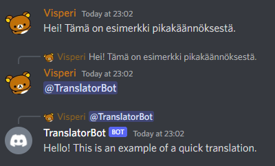
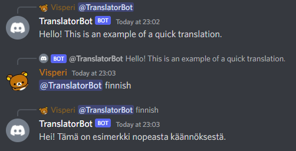
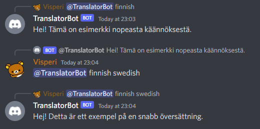

# TranslatorBot
A bot for translating Discord messages utilizing DeepL software. Both slash commands and message commands are supported. 
For supported languages see section [Supported languages](#supported-languages)

**Python 3.8 or higher is required to run this bot**

For package requirements see the `requirements.txt`

## Running the bot

Currently, this bot has no instance running in public usage. To run the bot yourself in any server, all you need is:

- Discord bot application and its API token: [Discord application docs](https://discordapp.com/developers/applications)
- DeepL account and token to their REST API: [DeepL API docs](https://www.deepl.com/pro-api?cta=header-pro-api/)
  - Both free and pro versions are supported. The version is automatically detected from the API key

Final step before running the bot is to make `credentials.json` file to the root directory of this bot. 
Place the generated API tokens there in below JSON syntax:

```json
{
    "api_tokens": {
        "deepl": "DeepL API token here",
        "discord": "Discord API token"
    }
}
```

Command prefix is `?` by default. To change this, see the variable `COMMAND_PREFIX` at the top of `main.py`. 
The prefix can also be an iterable of strings, such as `("?!", "!", "?")`, for multiple valid prefixes. 
More information and important notes about the prefix can be found from related 
[discord.py API section](https://discordpy.readthedocs.io/en/stable/ext/commands/api.html?highlight=prefix#discord.ext.commands.Bot.command_prefix).

## Features

Apart from bot owner commands, the bot supports both slash commands and regular message commands.

Current features:

- Translate text from given source language to a target language
- Translate text from automatically detected language to a target language
- Translate text from automatically detected language to English
- Get list of supported languages. Both language abbreviations and full language names are supported, and they are 
  case-insensitive.

Bot owner has the following features:

- Update supported languages in the DeepL API
- Synchronize slash commands (needed only when slash commands are added or removed)
- Check current usage status of the bot
- Load, unload or reload an extension atomically

### Quick translation

The bot also supports so-called quick translation by mentioning the bot on a reply to desired message. 
The original message will then be translated.

There are no mandatory arguments for quick translation. If omitted, the target language is English and source language 
is detected automatically.



The target language can also be given explicitly. The target language will be detected automatically.



Both source language and target language can also be given for more special cases, if e.g. the language detection fails.



## TODO features

- Support dynamic command prefix between Discord guilds
- Support DeepL glossary feature
- Support also Language object in `deepl.client.__translate`

## Supported languages

Following languages are currently supported by the DeepL API:

- `BG`: Bulgarian
- `CS`: Czech
- `DA`: Danish
- `DE`: German
- `EL`: Greek
- `EN-GB`: English (British)
- `EN-US`: English (American)
- `ES`: Spanish
- `ET`: Estonian
- `FI`: Finnish
- `FR`: French
- `HU`: Hungarian
- `ID`: Indonesian
- `IT`: Italian
- `JA`: Japanese
- `LT`: Lithuanian
- `LV`: Latvian
- `NL`: Dutch
- `PL`: Polish
- `PT-BR`: Portuguese (Brazilian)
- `PT-PT`: Portuguese (European)
- `RO`: Romanian
- `RU`: Russian
- `SK`: Slovak
- `SL`: Slovenian
- `SV`: Swedish
- `TR`: Turkish
- `UK`: Ukrainian
- `ZH`: Chinese (simplified)

# License
MIT License

Full license: [LICENSE](LICENSE)
